# 靓号功能优化（支持英文、数字及英文数字混合）后台端1.1增量需求文档

> 文档类型：后台端 1.1 增量需求文档  
> 适用范围：后台靓号商品配置、靓号发放记录、后台用户编号展示与检索兼容  
> 共存原则：本文只描述混合靓号相对现有数字靓号的后台侧变化。APP 用户搜索、客户端及房间用户展示规则，详见[《靓号功能优化（支持英文、数字及英文数字混合）APP端及跨端展示增量需求文档》](./靓号功能优化（支持英文数字混合）增量需求文档.md)。两份文档对“当前有效靓号、到期回退、基础身份ID不变”使用同一口径。

---

## 1. 版本目标与改动范围

现有后台商城配置、靓号台账及后台用户编号展示按纯数字靓号处理，无法闭环支持英文、数字及英文数字混合靓号。本版本完成后台靓号录入、格式与唯一性校验、发放记录来源/天数/撤回、以及全后台用户相关用户ID字段的展示与检索兼容。

### 1.1 本期纳入

- 后台商城靓号新增、编辑、上下架前的格式和唯一性校验。
- 靓号发放记录后台的用户原ID、当前昵称、来源、天数、撤回按钮状态及撤回后的天数扣减。
- 后台靓号兼容调整：全后台用户相关的用户ID字段统一命名、当前佩戴靓号展示、靓号搜索和过期回退；用户账号管理列表新增用户靓号字段及对应筛选。
- 靓号商品、用户拥有记录与当前生效靓号之间的数据一致性。
- 混合靓号的启用、替换、到期、回退和异常数据处理。

### 1.2 本期不新增

商城购买/赠送页、分类、价格、支付方式及既有后台页面中未明确调整的字段和流程继续沿用现有版本。特殊符号、中文、空格、Emoji不纳入本期。

---

## 2. 后台共用业务边界

### 2.1 核心业务对象

| 业务对象 | 定义 | 核心约束 |
|---|---|---|
| 普通用户编号 | 用户注册后获得的基础编号，用于账号身份和靓号失效后的回退展示 | 不因获得、启用或更换靓号而丢失 |
| 靓号商品 | 后台配置的可售卖/可赠送商品，包含靓号值、分类、价格、上下架状态 | 商品配置存在不代表靓号已被用户启用 |
| 靓号拥有记录 | 用户购买、受赠或活动获得靓号后形成的权益记录 | 可处于未使用、使用中、已过期等状态 |
| 当前生效靓号 | 用户当前正在使用且仍在有效期内的靓号 | 同一用户同一时刻最多一个；同一靓号同一时刻最多归属一个用户 |
| 展示用户编号 | APP 对外展示的编号 | 有有效靓号时展示靓号；否则展示普通用户编号 |
| 靓号搜索映射 | 用于从有效靓号定位当前用户的业务关系 | 只允许有效、唯一、未过期的生效关系参与搜索 |

### 2.2 身份编号与展示编号边界

1. 普通用户编号是用户基础身份，不得因混合靓号启用而丢失。
2. 混合靓号作为独立的展示别名和搜索入口，不再覆盖普通用户编号；不得造成同一字符串同时指向两个不同用户。
3. 靓号启用、替换和到期只改变当前展示靓号，不改变普通用户编号。
4. 靓号失效、到期或被替换后，用户仍可通过普通用户编号被正常识别和搜索。
5. APP 返回结果时必须同时保持用户身份稳定；不得把靓号文本误当成新的用户主身份重新创建用户。
6. 用户启用或更换靓号成功后，用户ID展示位立即切换为新的当前有效靓号；用户基础身份ID不变。
7. 房间内及房间信息中的房主ID、用户ID等用户相关展示位同步展示该用户当前佩戴的靓号；靓号失效后回退展示普通用户编号。

---

### 2.3 靓号格式、唯一性与有效期

#### 2.3.1 支持格式

| 类型 | 本期规则 | 示例 |
|---|---|---|
| 纯数字靓号 | 继续支持；允许以 `0` 开头，必须按完整文本保存、校验、搜索和展示 | `888888`、`001234` |
| 英文数字混合靓号 | 支持；至少包含1个英文字母和1个数字 | `rre1122`、`VIP520` |
| 纯英文字母靓号 | 支持 | `VIP` |
| 其他字符 | 不支持 | 中文、空格、连接符、下划线、Emoji、全角字符 |

后台保存前应去除首尾空格；去除后为空则按未输入处理。APP 搜索框仍是通用搜索框，不因本需求限制昵称或其他关键词的输入格式。

#### 2.3.2 长度

- 原型搜索示例 `rre1122` 为7位，因此目标规则至少要能完整录入、保存、搜索和展示7位靓号。
- 靓号最大长度统一为 **10位字符**；纯英文字母、纯数字和英文数字混合靓号均适用该限制。
- 后台输入、保存、搜索、展示和唯一索引必须使用同一10位字符限制，禁止各端各写一套。

#### 2.3.3 大小写

- `vip520`、`VIP520`、`Vip520` 视为同一靓号。
- 新增、编辑、重复判断、启用、搜索和历史数据迁移均按不区分大小写的口径处理；展示保留已保存靓号的录入大小写。

#### 2.3.4 唯一性

1. 同一靓号值只能存在一个可被启用的有效业务对象，不能因分类不同、价格不同或大小写不同而重复占用。
2. 新增与编辑均执行最终唯一性校验；编辑时排除当前记录自身。
3. 靓号不得与其他用户当前有效靓号重复。
4. 靓号不得与会造成搜索歧义的普通用户编号重复。
5. 同时提交两个相同靓号时，只允许一个成功，另一个提示已存在。
6. 前导0属于靓号完整文本的一部分；`001234` 与 `1234` 按不同靓号参与保存、唯一性校验、搜索和展示。
7. 唯一性比较必须使用统一标准化口径；不能后台判断不重复，保存后却在APP搜索中被当成同一个值。

#### 2.3.5 生效与归属

1. 靓号商品“上架”仅表示可获取，不代表已绑定给用户。
2. 用户获得靓号后，按现有使用流程启用；只有“使用中且未过期”的靓号参与展示和搜索。
3. 同一用户同一时刻最多有一个当前生效靓号。
4. 同一靓号同一时刻最多绑定一个用户。
5. 用户启用新靓号时，原当前生效靓号结束当前使用；新靓号成为唯一当前展示号。
6. 原靓号只要仍属于任一用户账户且未过期，不得解绑或释放回商城；不得因被替换而自动恢复为可售商品。
7. 同一用户拥有多个靓号时，不能再通过“取值最大”决定显示哪个；必须以明确的当前使用状态为准。

#### 2.3.6 到期与回退

1. 有固定有效期的靓号到期后立即停止参与搜索和展示。
2. 所有靓号均按已配置的固定有效期管理；有效期结束后停止搜索和展示。
3. 靓号到期后，展示用户编号回退为普通用户编号。
4. 到期靓号不得继续通过历史缓存命中用户。
5. 历史拥有记录继续保留，用于订单、客服和运营查询；历史记录不得参与当前用户搜索。

---

## 3. 后台新增/编辑靓号模块

### 3.1 页面定位

沿用现有商城靓号弹窗，仅调整“靓号”字段及其校验、保存和生效关联。

### 3.2 对应原型

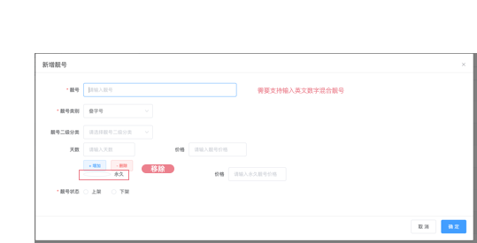

原型明确改动：靓号输入项需要支持输入英文数字混合靓号。

### 3.3 页面字段

| 字段/控件 | 原型可见 | 本期变化 | 规则 |
|---|---:|---|---|
| 靓号 | 是 | **调整** | 从仅支持整数调整为支持纯英文字母、纯数字或英文数字混合文本；最长10位字符，纯数字允许以0开头 |
| 靓号类型 | 是 | 沿用 | 沿用现有分类选择，不因字符类型自动改分类 |
| 靓号二级分类 | 是 | 沿用 | 选择范围与联动规则不变 |
| 天数 | 是 | 沿用 | 固定期限价格项继续按现有规则配置 |
| 价格 | 是 | 沿用 | 与对应天数绑定，校验规则不变 |
| 新增/移除价格项 | 是 | 沿用 | 沿用现有操作规则 |
| 靓号状态 | 是 | 沿用 | 上架/下架逻辑不变 |
| 取消 | 是 | 沿用 | 关闭弹窗，不保存本次输入 |
| 确定 | 是 | **联动调整** | 提交时执行混合格式、长度、唯一性及冲突校验 |

### 3.4 输入与提示规则

| 场景 | 系统处理 | 提示文案 |
|---|---|---|
| 未输入 | 阻止保存 | `请输入靓号` |
| 仅含数字（包含以0开头） | 按完整文本进入后续校验，不得转为数值或丢失前导0 | - |
| 仅含英文字母 | 允许进入后续校验 | - |
| 同时含英文字母和数字 | 允许进入后续校验 | - |
| 含中文、空格、符号或Emoji | 阻止保存 | `靓号仅支持英文字母和数字` |
| 超过10位字符 | 阻止保存 | `靓号长度不能超过10位` |
| 与已有靓号重复 | 阻止保存 | `该靓号已存在` |
| 与普通用户编号冲突 | 阻止保存 | `该靓号已被占用` |
| 并发提交后被其他记录先占用 | 当前提交失败，不生成重复数据 | `该靓号已存在，请重新输入` |

### 3.5 新增流程

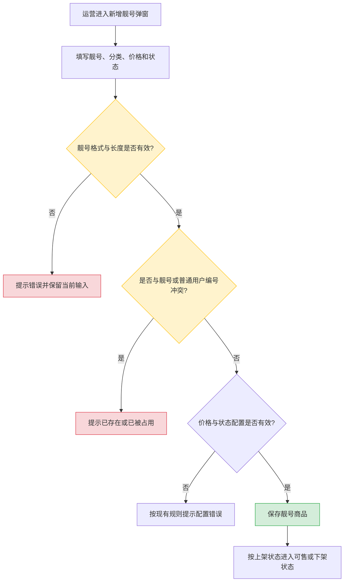

### 3.6 编辑规则

1. 编辑页面回显靓号时必须保留完整字母和数字，不得截断或转为纯数字。
2. 未修改靓号值时，重复校验排除当前记录自身。
3. 靓号值创建后不可修改；编辑仅允许修改分类、价格和上下架状态。
4. 已产生拥有记录、使用记录或历史订单的靓号同样不可修改靓号值，避免订单与用户权益指向错误。
5. 已被用户使用的靓号不得因编辑商品标题而悄悄变成另一个靓号。

### 3.7 业务处理规则

1. 商品、用户权益和当前生效归属必须引用同一靓号值；上架前复核商城商品、靓号台账和普通用户编号的占用情况。
2. 商品保存与靓号资产占用必须同成功/同失败，禁止半成功状态；历史订单/权益存在时，不得直接改靓号值。
3. 新增、编辑、上下架和冲突失败沿用现有运营操作留痕。

### 3.8 靓号发放记录后台

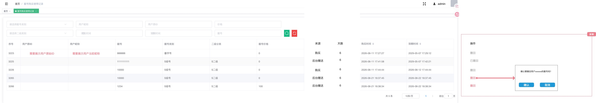

本节仅描述原型红字、红框及“新增”标注内容；未标注的列表字段沿用现有规则。

#### 页面字段与新增内容

| 字段/区域 | 本期规则 |
|---|---|
| 用户原ID | 展示用户原始ID |
| 用户昵称 | 展示用户当前昵称 |
| 来源 | 展示本条靓号权益的获得来源：商城购买 / 后台发放。 |
| 天数 | 商城购买来源展示本次购买天数；后台发放来源展示本次赠送天数。 |
| 操作列 | 新增撤回相关操作状态 |

#### 撤回按钮状态

| 记录条件 | 展示 | 可操作性 |
|---|---|---|
| 来源为后台发放，且未撤回 | 红色“撤回” | 可点击 |
| 来源为后台发放，且已撤回 | 灰色“已撤回” | 不可点击 |
| 来源为购买 | 灰色“撤回” | 不可点击 |

#### 撤回交互与处理规则

1. 点击可用的红色“撤回”后，弹出撤回确认弹窗；弹窗展示目标用户标识和靓号，提供“确认”“取消”按钮。
2. 点击“取消”关闭弹窗，不改变发放记录、靓号权益和剩余天数。
3. 点击“确认”后，将该后台发放记录标记为已撤回，并按该条记录的发放天数扣减靓号剩余天数。
4. 扣减公式：`扣减后剩余天数 = max(0，撤回前剩余天数 - 本次发放天数)`；剩余天数不足时最多扣减到0，不得出现负数。
5. 已撤回记录不可再次撤回；重复提交不得重复扣减天数。
6. 购买来源记录不允许撤回，始终显示灰色“撤回”按钮；本期不因该按钮改变购买订单规则。
7. 扣减后剩余天数为0时，按统一有效期规则停止该靓号的搜索和展示；仍大于0时，按扣减后的有效期继续处理。

### 3.9 后台-靓号兼容调整

<strong>靓号兼容范围：全后台用户相关的用户ID字段。</strong>

#### 开发定位原型

以下图片仅用于开发定位圈选位置；本节不定义或调整图片内其他字段。

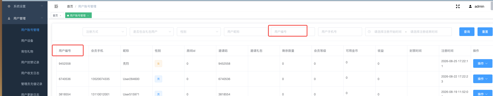

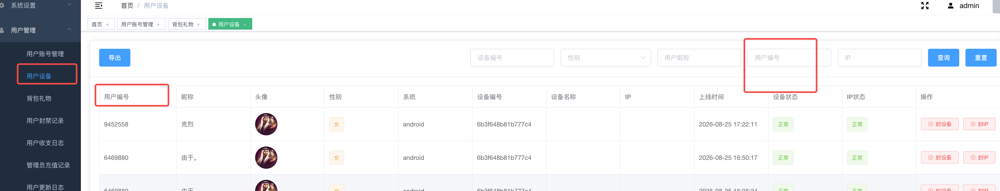

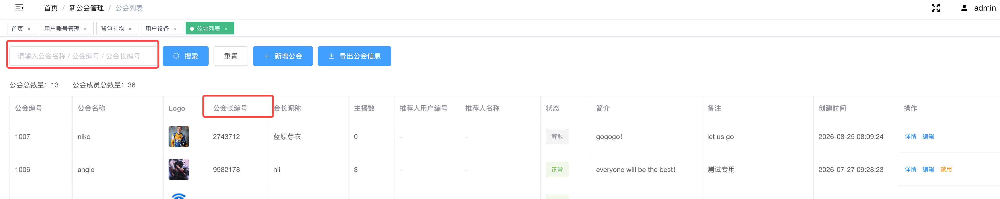

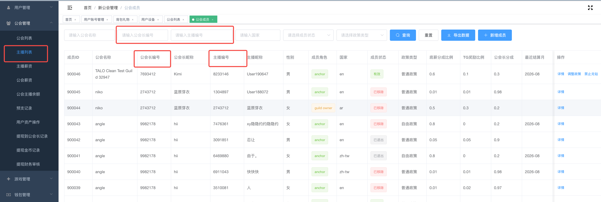

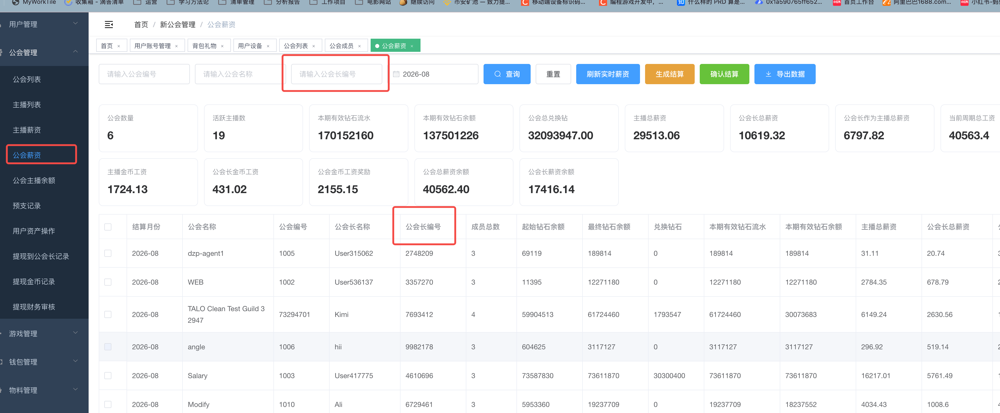

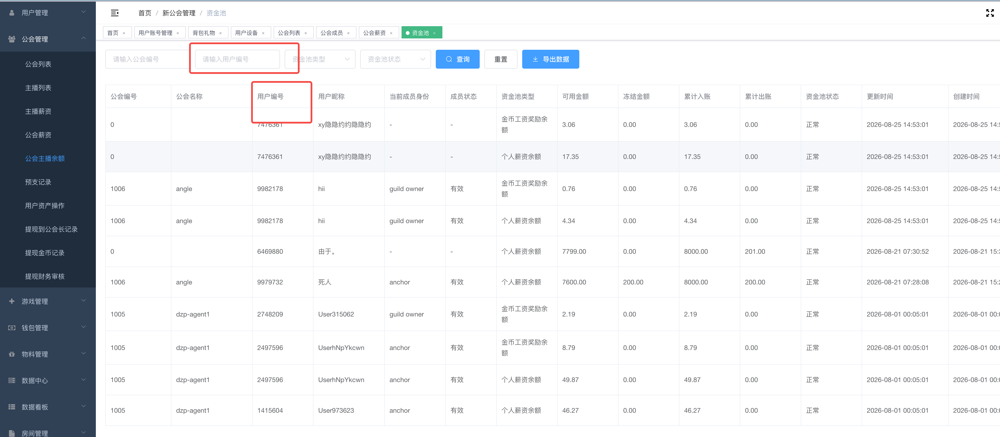

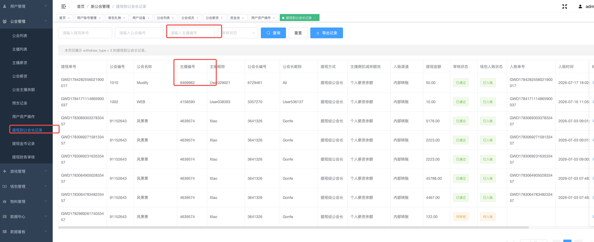

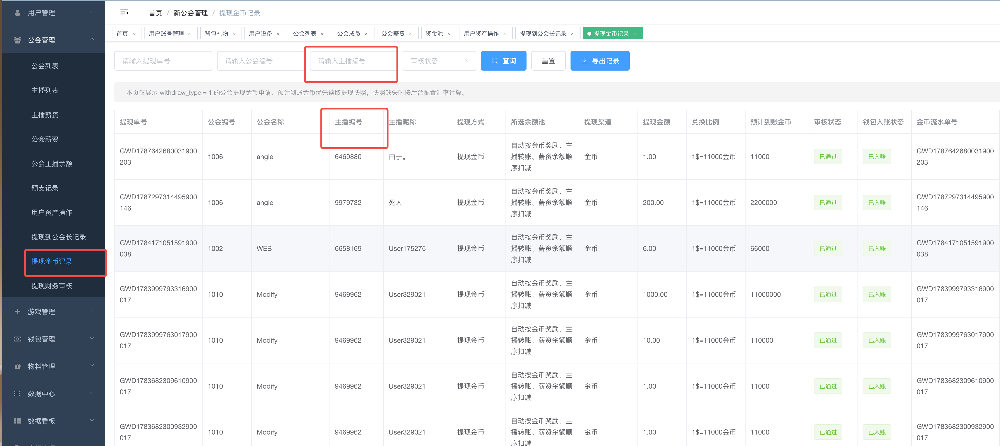

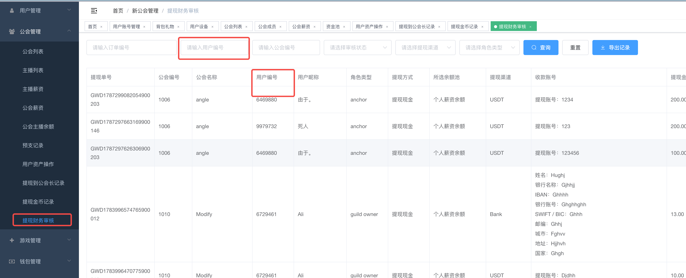

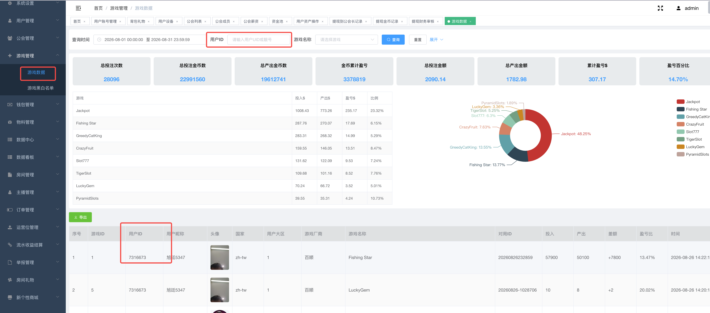

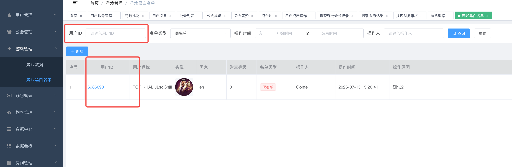

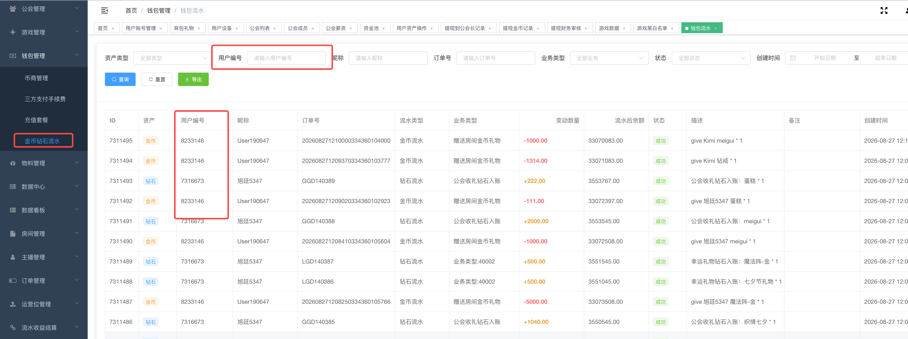

#### 编号字段命名统一

1. 原型圈选位置中原名为“用户编号”“主播编号”“公会编号”“公会长编号”的相关字段，统一更名为“用户ID”“主播ID”“公会ID”“公会长ID”。
2. 本次仅统一字段展示名称；公会ID为公会实体标识，不随用户佩戴靓号变化。

#### 靓号展示、搜索与回退

#### 用户账号管理列表：用户靓号字段与搜索

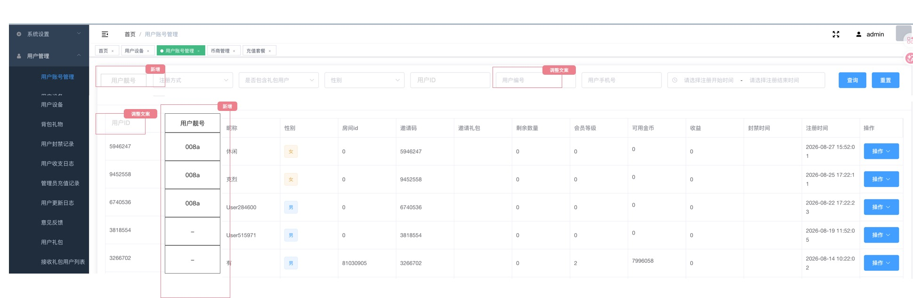

本节仅描述原型明确标注的“用户靓号”新增字段及其搜索能力；不调整原型内其他未点名字段。

| 区域 | 字段 | 本期规则 |
|---|---|---|
| 用户列表 | 用户靓号 | **新增字段**。展示该用户当前正在使用的靓号。 |
| 筛选区 | 用户靓号 | **新增筛选项**。输入用户当前正在使用的有效靓号并查询时，返回对应用户。 |

1. 用户靓号字段为用户列表中的独立展示字段，不替代既有用户ID字段。
2. 仅用户当前正在使用且未过期的靓号参与该字段展示和“用户靓号”筛选；未使用、已替换、已过期靓号均不得展示或命中。
3. 用户切换靓号后，列表字段和“用户靓号”筛选均以新靓号为准；旧靓号不得继续命中该用户。
4. 用户靓号过期后，该字段不再展示该过期靓号，且使用该过期靓号搜索不得命中该用户。
5. 既有其他筛选项、用户ID搜索及列表字段的规则不因新增“用户靓号”字段而改变。

1. 用户使用或切换使用某个靓号成功后，后台所有用户相关的用户ID、主播ID、公会长ID展示位，均展示该用户当前正在使用的靓号ID。
2. 上述范围内的搜索、筛选或用户定位入口，输入用户当前正在使用的有效靓号，必须能够搜索并定位到该用户；用户原始ID继续可用于搜索和定位。
3. 用户切换靓号后，所有上述展示位和搜索结果统一以新靓号为准，不得继续展示或命中旧靓号。
4. 用户靓号过期后，后台上述展示位重新展示该用户原始ID；过期靓号不得继续用于搜索或定位该用户。
5. 用户原始身份ID不变；本模块只改变后台用户相关编号字段的展示与搜索口径，不改变用户基础身份、公会实体ID及其既有数据关联。

---

---

## 4. 获得、启用、替换与到期闭环

### 4.1 生命周期

| 状态 | 定义 | 是否可购买/赠送 | 是否可启用 | 是否参与搜索 | 是否对外展示 |
|---|---|---:|---:|---:|---:|
| 下架 | 商品不可获取 | 可赠送 | 已拥有用户按现有规则处理 | 仅当前有效归属可参与 | 仅当前有效归属可展示 |
| 可获取 | 商品已上架且未被占用 | 是 | 获得后可按现有流程启用 | 否 | 否 |
| 未使用 | 用户已拥有但尚未启用 | - | 是 | 否 | 否 |
| 使用中 | 用户已启用且未过期 | 不可赠送/不可购买 | 已是当前生效状态 | 是 | 是 |
| 已替换 | 用户启用新靓号后，旧靓号结束当前使用，但其有效权益仍归属原用户 | 不可购买/不可赠送；未过期且仍归属用户账户时不得解绑或释放回商城 | 按权益状态处理 | 否 | 否 |
| 已过期 | 有效期结束 | 按现有续费/重新获取规则 | 否，除非重新获得有效权益 | 否 | 否 |

### 4.2 启用与替换规则

1. 用户启用混合靓号前，系统再次确认：权益有效、未过期、未被其他用户使用。
2. 用户没有当前靓号时，启用成功后直接成为当前展示号。
3. 用户已有当前靓号时，启用新靓号后，新靓号生效，旧靓号结束当前使用；旧靓号未过期且仍归属用户账户时，保留其权益归属，不得解绑或释放回商城。
4. 新旧状态必须一次完成；不得出现两个靓号同时有效，也不得出现旧靓号已解除但新靓号未生效的中间脏状态。
5. 启用失败时，原当前靓号保持不变。
6. 同一启用请求被重复提交时，只产生一次最终状态，不重复生成多个当前归属。

### 4.3 生命周期流程

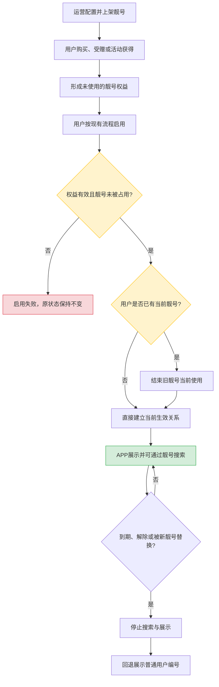

### 4.4 商品、权益与生效关系一致性

商品、权益、当前生效记录和历史订单必须可追溯到同一靓号值；购买/赠送成功后，只有进入“使用中”才参与搜索和展示。商城商品与当前靓号归属必须建立明确关联，历史订单不得因编辑商品而改显示值。

---

---

## 5. 后台异常与回归关注点

| 场景 | 必须成立的结果 |
|---|---|
| 大小写、空格、全角字符、符号 | 按最终字符规则统一校验，不得绕过唯一性 |
| 并发新增/编辑 | 同一靓号只允许一条成功；编辑未改值不误报自身重复 |
| 并发启用 | 同一用户仅一条当前生效记录；同一靓号仅一个用户成功 |
| 启用失败/替换 | 失败时旧靓号保持；成功后旧靓号停止作为当前展示靓号 |
| 未使用、已解除、已过期靓号 | 不参与当前用户展示或检索；用户原始ID可继续识别 |
| 到期、续期、重新启用 | 到期后停止按靓号命中；恢复后不得复用失效缓存 |
| 靓号类型与长度 | 纯英文字母、纯数字、英文数字混合均可保存；长度不超过10位字符 |
| 大小写与前导0 | 大小写不同的同值靓号不可重复；`001234`按完整值保存、检索和展示 |
| 编辑靓号值 | 靓号创建后不可修改；编辑分类、价格或状态不得改写靓号值 |
| 替换后旧靓号 | 旧靓号未过期且仍归属用户账户时不可解绑或释放回商城 |
| 用户账号管理：用户靓号字段与搜索 | 列表展示用户当前正在使用的靓号；以当前有效靓号筛选能命中对应用户；切换或过期后旧靓号不得继续展示或命中 |
| 后台靓号兼容 | 全后台用户相关的用户ID、主播ID、公会长ID展示位展示当前有效靓号；支持按当前有效靓号定位用户；过期后回退原始ID |

---

## 6. 代码证据锚点

| 结论 | 证据位置 |
|---|---|
| 后台入口按整数校验；商城商品字段虽可保存文本但重复校验未跨模型 | `manage-api/.../Admin/Mall/GoodCodeController.php:128-162`；`GoodCodeRepository.php:63-71,95-102`；`top-app-api/.../docs/db/app.sql:221668-221679` |
| 商城购买、后台赠送和现有穿戴代码未证明会建立当前靓号归属 | `manage-api/.../MallProductsRepository.php:689-778`；`top-app-api/.../PersonalMallServiceImpl.java:208-240,270-355,758-780` |
| 旧靓号台账当前按数字校验并限制位数 | `manage-api/.../GoodNumberController.php:30-64` |
| 旧绑定逻辑会保存历史原编号、再用靓号覆盖普通用户编号 | `manage-api/.../UserDataRepository.php:83-112`；`GoodNumberRepository.php:119-123,255-288` |
| 靓号、普通用户编号和历史原编号数据库字段当前均为整数 | `top-app-api/.../docs/db/app.sql:12407-12420,241882-241887` |
| 注册普通用户编号只避让普通用户编号和旧靓号台账，不避让商城商品标题 | `top-app-api/.../GoodNumberService.java:39-49,96-104` |

---

## 7. 已确认决策

| 编号 | 已确认规则 | 已同步位置 |
|---|---|---|
| Q1 | 靓号最长10位字符 | 第2.3.2节、第3.3节、第3.4节、第5节 |
| Q2 | 大小写视为同一靓号；唯一性、启用和检索均不区分大小写 | 第2.3.3节、第2.3.4节、第3.4节、第5节 |
| Q3 | 支持纯英文字母、纯数字和英文数字混合靓号 | 第1章、第2.3.1节、第3.3节、第3.4节、第5节 |
| Q4 | 靓号创建后不可修改靓号值；仅可编辑分类、价格和上下架状态 | 第3.6节、第3.7节、第5节 |
| Q6 | 靓号只要仍属于某个用户账户且未过期，不得解绑或释放回商城 | 第2.3.5节、第4.1节、第4.2节、第5节 |
| Q7 | 允许以0开头的纯数字靓号，必须按完整文本保存、校验、检索和展示 | 第2.3.1节、第3.3节、第3.4节、第5节 |
| Q9 | 全后台用户相关的用户ID字段均纳入靓号兼容；过期后统一回退原始ID | 第3.9节、第5节 |
| Q10 | 用户账号管理列表新增“用户靓号”字段和筛选项；仅当前正在使用且未过期的靓号展示、可命中用户 | 第1.1节、第3.9节、第5节 |
