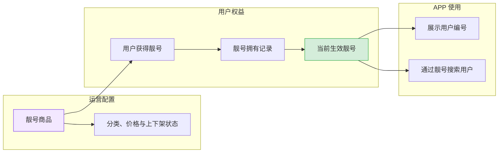
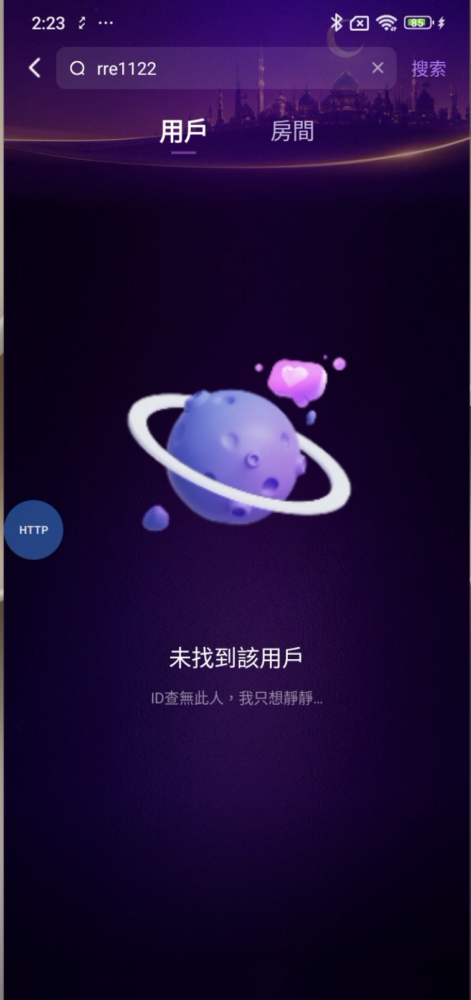
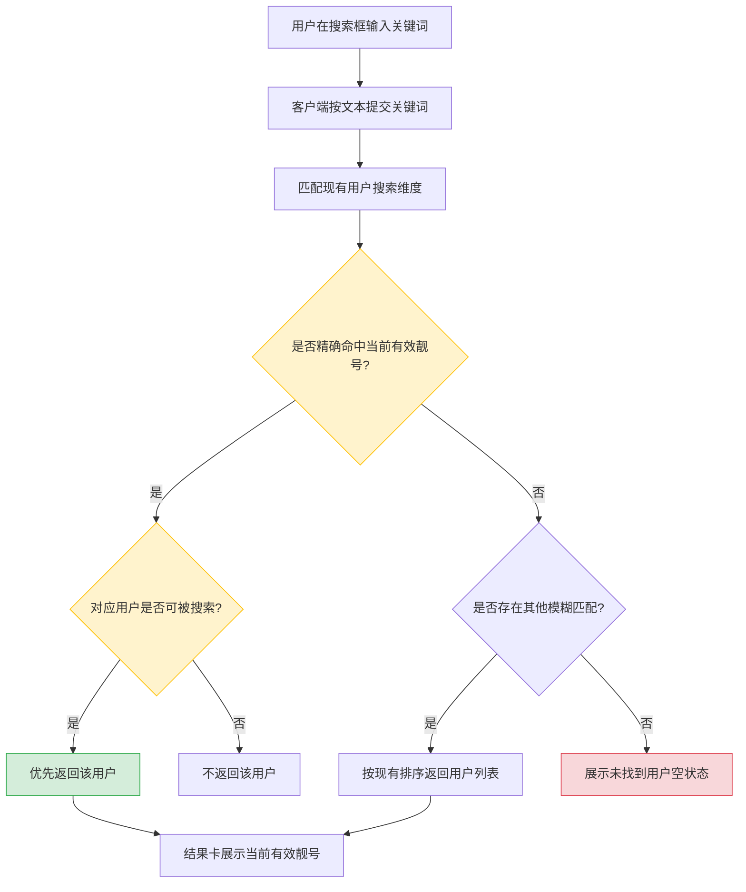
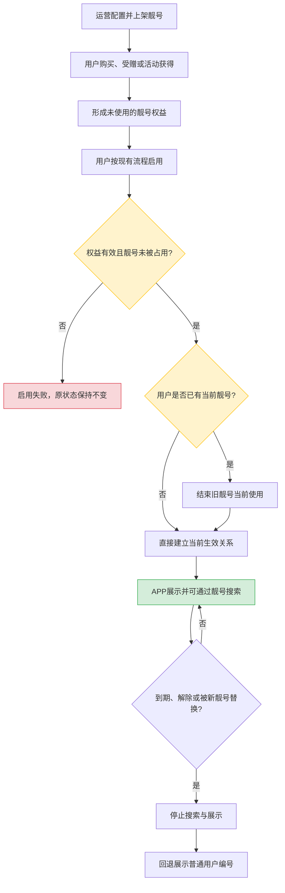

# 靓号功能优化（支持英文、数字及英文数字混合）APP端及跨端展示增量需求文档

> 文档类型：APP端及跨端展示增量需求文档  
> 适用范围：靓号生效链路、APP 用户搜索、客户端及房间用户展示  
> 后台版本：后台商城靓号配置、靓号发放记录及全后台用户ID兼容，详见[《靓号功能优化（支持英文、数字及英文数字混合）后台端1.1增量需求文档》](./靓号功能优化（支持英文数字混合）后台端1.1增量需求文档.md)。  
> 事实源：用户当前确认 > 本目录原型图 > 当前源码已实现逻辑  
> 共存原则：本文只描述APP端及跨端展示变化；后台侧规则以独立后台端1.1增量需求文档为准。未涉及的购买、赠送、佩戴、到期、用户搜索和页面样式继续沿用现有规则。

---

## 1. 需求背景与目标

### 1.1 背景与目标

现有后台和靓号台账按纯数字处理，APP 搜索虽可接收文本，但无法完成英文、数字及英文数字混合靓号的配置、归属、生效、搜索和展示闭环。本期支持纯英文字母、纯数字和英文数字混合靓号，并保持普通用户编号和历史记录兼容。

本期目标：用户按现有流程获得并启用后，APP 用户搜索及现有展示场景可正确命中和展示英文、数字及英文数字混合靓号；普通用户编号和历史记录保持兼容。

1. 用户按现有流程启用本期靓号后，APP“搜索—用户”可通过该靓号查找到对应用户。
2. 搜索结果、用户资料及现有使用靓号的展示场景能正确显示本期靓号。
3. 现有纯数字靓号、普通用户编号和历史记录不受影响。

### 1.2 业务主线

> 配置/上架 → 用户获得 → 启用并建立唯一当前归属 → APP 搜索与展示 → 到期/替换后停止命中并回退普通用户编号。

---

## 2. 原型与改动范围

### 2.1 原型对位

| 模块 | 原型文件 | 原型明确表达 | 本文处理方式 |
|---|---|---|---|
| APP 用户搜索 | `靓号功能优化-原型图/搜索页面.jpg` | 在“用户”Tab 输入 `rre1122` 后当前显示“未找到该用户” | 目标为有效混合靓号存在时返回对应用户；无有效归属时继续展示原空状态 |

### 2.2 本期纳入

- 混合靓号的启用、替换、到期、回退和异常数据处理。
- APP 搜索页“用户”Tab 对混合靓号的输入、查询、排序和结果展示。
- 好友、关注、粉丝、房间发现，以及房内在线用户、排麦、黑名单、禁言等现有查人入口的混合靓号兼容。
- 现有已使用靓号的用户资料、用户列表、关系列表、榜单、私聊和房间内用户信息等展示场景的兼容回归。
- 历史纯数字靓号的数据迁移与兼容。

### 2.3 本期不新增

商城购买/赠送页、我的靓号页面、分类/价格/支付方式及搜索结果卡片样式均沿用现有版本；后台配置、后台发放记录及后台用户ID兼容不在本文重复描述，详见后台端1.1增量需求文档。不新增房间Tab业务，但现有房间内及房间信息中的用户相关展示位须适配用户当前佩戴靓号。特殊符号、中文、空格、Emoji不纳入本期。

---

## 3. 业务模型

### 3.1 核心业务对象

| 业务对象 | 定义 | 核心约束 |
|---|---|---|
| 普通用户编号 | 用户注册后获得的基础编号，用于账号身份和靓号失效后的回退展示 | 不因获得、启用或更换靓号而丢失 |
| 靓号商品 | 后台配置的可售卖/可赠送商品，包含靓号值、分类、价格、上下架状态 | 商品配置存在不代表靓号已被用户启用 |
| 靓号拥有记录 | 用户购买、受赠或活动获得靓号后形成的权益记录 | 可处于未使用、使用中、已过期等状态 |
| 当前生效靓号 | 用户当前正在使用且仍在有效期内的靓号 | 同一用户同一时刻最多一个；同一靓号同一时刻最多归属一个用户 |
| 展示用户编号 | APP 对外展示的编号 | 有有效靓号时展示靓号；否则展示普通用户编号 |
| 靓号搜索映射 | 用于从有效靓号定位当前用户的业务关系 | 只允许有效、唯一、未过期的生效关系参与搜索 |

### 3.2 业务对象关系图



### 3.3 身份编号与展示编号边界

1. 普通用户编号是用户基础身份，不得因混合靓号启用而丢失。
2. 混合靓号作为独立的展示别名和搜索入口，不再覆盖普通用户编号；不得造成同一字符串同时指向两个不同用户。
3. 靓号启用、替换和到期只改变当前展示靓号，不改变普通用户编号。
4. 靓号失效、到期或被替换后，用户仍可通过普通用户编号被正常识别和搜索。
5. APP 返回结果时必须同时保持用户身份稳定；不得把靓号文本误当成新的用户主身份重新创建用户。
6. 用户启用或更换靓号成功后，用户ID展示位立即切换为新的当前有效靓号；用户基础身份ID不变。
7. 房间内及房间信息中的房主ID、用户ID等用户相关展示位同步展示该用户当前佩戴的靓号；靓号失效后回退展示普通用户编号。

---

## 4. 全局业务规则

### 4.1 支持格式

| 类型 | 本期规则 | 示例 |
|---|---|---|
| 纯数字靓号 | 继续支持；允许以 `0` 开头，必须按完整文本保存、校验、搜索和展示 | `888888`、`001234` |
| 英文数字混合靓号 | 支持；至少包含1个英文字母和1个数字 | `rre1122`、`VIP520` |
| 纯英文字母靓号 | 支持 | `VIP` |
| 其他字符 | 不支持 | 中文、空格、连接符、下划线、Emoji、全角字符 |

后台保存前应去除首尾空格；去除后为空则按未输入处理。APP 搜索框仍是通用搜索框，不因本需求限制昵称或其他关键词的输入格式。

### 4.2 长度

- 原型搜索示例 `rre1122` 为7位，因此目标规则至少要能完整录入、保存、搜索和展示7位靓号。
- 靓号最大长度统一为 **10位字符**；纯英文字母、纯数字和英文数字混合靓号均适用该限制。
- 后台输入、保存、搜索、展示和唯一索引必须使用同一10位字符限制，禁止各端各写一套。

### 4.3 大小写

- `vip520`、`VIP520`、`Vip520` 视为同一靓号。
- 新增、编辑、重复判断、启用、搜索和历史数据迁移均按不区分大小写的口径处理；展示保留已保存靓号的录入大小写。

### 4.4 唯一性

1. 同一靓号值只能存在一个可被启用的有效业务对象，不能因分类不同、价格不同或大小写不同而重复占用。
2. 新增与编辑均执行最终唯一性校验；编辑时排除当前记录自身。
3. 靓号不得与其他用户当前有效靓号重复。
4. 靓号不得与会造成搜索歧义的普通用户编号重复。
5. 同时提交两个相同靓号时，只允许一个成功，另一个提示已存在。
6. 前导0属于靓号完整文本的一部分；`001234` 与 `1234` 按不同靓号参与保存、唯一性校验、搜索和展示。
7. 唯一性比较必须使用统一标准化口径；不能后台判断不重复，保存后却在APP搜索中被当成同一个值。

### 4.5 生效与归属

1. 靓号商品“上架”仅表示可获取，不代表已绑定给用户。
2. 用户获得靓号后，按现有使用流程启用；只有“使用中且未过期”的靓号参与展示和搜索。
3. 同一用户同一时刻最多有一个当前生效靓号。
4. 同一靓号同一时刻最多绑定一个用户。
5. 用户启用新靓号时，原当前生效靓号结束当前使用；新靓号成为唯一当前展示号。
6. 原靓号只要仍属于任一用户账户且未过期，不得解绑或释放回商城；不得因被替换而自动恢复为可售商品。
7. 同一用户拥有多个靓号时，不能再通过“取值最大”决定显示哪个；必须以明确的当前使用状态为准。

### 4.6 到期与回退

1. 有固定有效期的靓号到期后立即停止参与搜索和展示。
2. 所有靓号均按已配置的固定有效期管理；有效期结束后停止搜索和展示。
3. 靓号到期后，展示用户编号回退为普通用户编号。
4. 到期靓号不得继续通过历史缓存命中用户。
5. 历史拥有记录继续保留，用于订单、客服和运营查询；历史记录不得参与当前用户搜索。

### 4.7 搜索与排序

1. APP 用户搜索继续支持用户编号、昵称和有效靓号等现有搜索维度。
2. 输入纯英文字母、纯数字或英文数字混合靓号关键词时，不得因为关键词包含字母或前导0而被拦截、强制转换为数字或丢失字符。
3. 有效靓号精确命中时，对应用户排在普通模糊命中结果之前。
4. 包含匹配继续沿用现有用户搜索规则；精确匹配和模糊匹配必须采用同一大小写口径。
5. 已过期、已解除、未启用的靓号不能命中用户。
6. 被删除、停用或处于现有不可搜索状态的用户，继续沿用现有过滤规则，不因靓号命中而绕过。
7. 好友、关注、粉丝等关系搜索若保留现有关系时间排序，可不新增精确命中置顶；但必须能够按有效混合靓号命中目标用户。
8. 房内在线用户、排麦、黑名单和禁言等查人入口不得继续依赖“靓号覆盖普通用户编号”；应同时识别普通用户编号与当前有效靓号，并统一执行有效期过滤。

---

## 5. APP 用户搜索模块

### 5.1 页面定位

沿用搜索页和“用户”Tab结构，仅调整英文数字混合靓号的输入、命中和展示。

### 5.2 对应原型



原型当前状态：搜索框输入 `rre1122`，选中“用户”Tab，页面显示：

- 主文案：`未找到該用戶`
- 副文案：`ID查無此人，我只想靜靜...`

目标状态：当 `rre1122` 是某用户当前有效混合靓号时，返回该用户；仅在不存在有效归属时保留以上空状态。

### 5.3 页面改动点

| 位置 | 本期变化 | 规则 |
|---|---|---|
| 搜索框 | 支持输入英文与数字组合 | 不得使用仅数字键盘或本地纯数字校验拦截字母 |
| 清除按钮 | 沿用 | 清空关键词后恢复搜索页初始状态 |
| 搜索按钮 | 联动调整 | 字母数字混合关键词可正常发起搜索 |
| 用户/房间Tab | 沿用 | 本期目标为“用户”Tab；切换规则不变 |
| 用户结果卡片 | 沿用结构 | 命中混合靓号时，在现有用户编号展示位置显示当前有效靓号 |
| 用户空状态 | 沿用 | 无匹配用户时继续显示当前本地化空状态 |

### 5.4 搜索交互

1. 用户输入 `rre1122` 并点击“搜索”或执行现有提交动作。
2. 客户端按文本原样提交关键词，不将其转换为数字，不删除中间字母。
3. 服务端在当前可搜索用户范围内匹配：
   - 用户基础编号；
   - 用户昵称；
   - 用户当前有效靓号；
   - 其他现有搜索维度保持不变。
4. 若有效靓号精确命中，优先返回对应用户。
5. 若只有部分包含匹配，按现有模糊搜索规则返回，并保持现有分页/数量限制。
6. 搜索结果中展示当前有效靓号；点击结果进入现有用户资料页。
7. 用户资料页继续展示同一个有效靓号，不能搜索结果显示靓号、进入资料页后又显示另一个编号。

### 5.5 搜索结果规则

| 场景 | 结果 |
|---|---|
| 输入值精确等于某用户有效混合靓号 | 返回该用户，按精确命中优先展示 |
| 输入值仅部分命中有效混合靓号 | 沿用现有模糊搜索规则返回 |
| 混合靓号存在商品配置但未被用户启用 | 不返回用户 |
| 混合靓号已被用户拥有但处于未使用 | 不返回用户 |
| 混合靓号已过期或已解除 | 不返回原用户 |
| 混合靓号刚被新用户启用 | 仅返回当前有效归属用户 |
| 用户被删除、停用或处于现有不可搜索状态 | 不因靓号命中而放宽现有过滤 |
| 无任何用户匹配 | 展示现有空状态和本地化文案 |

### 5.6 搜索业务流程



### 5.7 页面状态

| 状态 | 触发条件 | 页面表现 |
|---|---|---|
| 初始态 | 未提交关键词 | 沿用当前页面 |
| 搜索中 | 已提交，结果未返回 | 沿用当前加载表现，避免重复提交造成闪烁 |
| 有结果 | 命中至少一个可搜索用户 | 展示现有用户结果列表 |
| 无结果 | 未命中可搜索用户 | 展示原型空状态 |
| 请求失败 | 网络或系统异常 | 沿用现有失败提示；不得错误展示为“未找到用户”掩盖系统异常 |

---

## 6. 获得、启用、替换与到期闭环

### 6.1 生命周期

| 状态 | 定义 | 是否可购买/赠送 | 是否可启用 | 是否参与搜索 | 是否对外展示 |
|---|---|---:|---:|---:|---:|
| 下架 | 商品不可获取 | 可赠送 | 已拥有用户按现有规则处理 | 仅当前有效归属可参与 | 仅当前有效归属可展示 |
| 可获取 | 商品已上架且未被占用 | 是 | 获得后可按现有流程启用 | 否 | 否 |
| 未使用 | 用户已拥有但尚未启用 | - | 是 | 否 | 否 |
| 使用中 | 用户已启用且未过期 | 不可赠送/不可购买 | 已是当前生效状态 | 是 | 是 |
| 已替换 | 用户启用新靓号后，旧靓号结束当前使用，但其有效权益仍归属原用户 | 不可购买/不可赠送；未过期且仍归属用户账户时不得解绑或释放回商城 | 按权益状态处理 | 否 | 否 |
| 已过期 | 有效期结束 | 按现有续费/重新获取规则 | 否，除非重新获得有效权益 | 否 | 否 |

### 6.2 启用与替换规则

1. 用户启用混合靓号前，系统再次确认：权益有效、未过期、未被其他用户使用。
2. 用户没有当前靓号时，启用成功后直接成为当前展示号。
3. 用户已有当前靓号时，启用新靓号后，新靓号生效，旧靓号结束当前使用；旧靓号未过期且仍归属用户账户时，保留其权益归属，不得解绑或释放回商城。
4. 新旧状态必须一次完成；不得出现两个靓号同时有效，也不得出现旧靓号已解除但新靓号未生效的中间脏状态。
5. 启用失败时，原当前靓号保持不变。
6. 同一启用请求被重复提交时，只产生一次最终状态，不重复生成多个当前归属。

### 6.3 生命周期流程



### 6.4 商品、权益与生效关系一致性

商品、权益、当前生效记录和历史订单必须可追溯到同一靓号值；购买/赠送成功后，只有进入“使用中”才参与搜索和展示。商城商品与当前靓号归属必须建立明确关联，历史订单不得因编辑商品而改显示值。

---

## 7. 展示一致性与兼容范围

### 7.1 展示优先级

```text
当前有效靓号存在 → 展示当前有效靓号
当前有效靓号不存在 → 展示普通用户编号
```

### 7.2 需要保持一致的现有场景

以下场景纳入兼容回归：搜索结果、用户主页、关系列表、榜单/用户卡片、私聊、房间发现/房主信息、房内资料、在线用户、排麦、黑名单、禁言和访问记录。

所有场景使用同一当前有效靓号口径，不得自行取“最大靓号”或跳过有效期校验。用户启用或更换靓号成功后，用户ID、房间内用户ID、房主ID及房间信息中的用户相关展示位必须刷新为用户当前佩戴的靓号；靓号失效后统一回退为普通用户编号。房内查人必须同时支持独立有效靓号，否则靓号与普通用户编号分离后会断链。

### 7.3 多语言与字符方向

1. 英文字母和数字本身按从左到右展示。
2. 在阿拉伯语等从右到左页面中，靓号作为独立编号整体展示，避免字符顺序被反转。
3. “未找到用户”等提示继续走现有多语言，不新增写死中文/繁体中文文案。
4. 靓号值本身不是翻译文案，不做翻译或本地化替换。

---

## 8. 异常与测试关注点

### 8.1 关键反例与回归范围

| 场景 | 必须成立的结果 |
|---|---|
| 大小写、空格、全角字符、符号 | 按最终字符规则统一校验，不得绕过唯一性 |
| 并发新增/编辑 | 同一靓号只允许一条成功；编辑未改值不误报自身重复 |
| 并发启用 | 同一用户仅一条当前生效记录；同一靓号仅一个用户成功 |
| 启用失败/替换 | 失败时旧靓号保持；成功后旧靓号停止搜索 |
| `rre1122` 精确或部分搜索 | 精确有效靓号优先；模糊结果沿用现有规则 |
| 未使用、已解除、已过期靓号 | 不参与搜索和展示；用户普通编号可继续识别 |
| 搜索/主页/列表/房间 | 使用同一当前靓号；房内在线、排麦、黑名单、禁言均支持有效靓号查人 |
| 好友/关注/粉丝/房间搜索 | 能按有效混合靓号命中，保留各入口既有排序规则 |
| 到期、续期、重新启用 | 到期停止命中；恢复不复用失效缓存 |
| 靓号类型与长度 | 纯英文字母、纯数字、英文数字混合均可保存；长度不超过10位字符 |
| 大小写与前导0 | 大小写不同的同值靓号不可重复；`001234` 按完整值保存、搜索和展示 |
| 编辑靓号值 | 靓号创建后不可修改；编辑分类、价格或状态不得改写靓号值 |
| 替换后旧靓号 | 旧靓号未过期且仍归属用户账户时不可解绑或释放回商城 |
| 房间展示 | 房主、房内用户及房间信息中的用户相关展示位展示用户当前佩戴靓号；失效后回退普通用户编号 |
| 多语言展示 | 英文与数字顺序不被RTL页面反转 |


---

## 9. 代码证据锚点

| 结论 | 证据位置 |
|---|---|
| 用户搜索已按文本匹配有效靓号并区分精确优先 | `top-app-api/.../UserDataMapper.java:42-82,88-133` |
| 搜索入口只拦截空值和单个纯数字，不拦截混合值 | `top-app-api/.../IndexServiceImpl.java:639-658` |
| 好友/关注/粉丝及房间发现已能匹配有效靓号，但房内在线、排麦、黑名单、禁言仍只认用户ID/普通用户编号 | `top-app-api/.../FriendMapper.java:103-191`；`FollowMapper.java:65-153,340-428`；`RoomMapper.java:219-280`；`top-room-api/.../RoomOnlineUserMapper.java:35-54`；`RoomQueryService.java:400-420,4999-5055`；`RoomBlacklistMapper.java:37-63`；`RoomBannedMapper.java:17-43` |
| 当前多个查询对同一用户使用最大靓号，字符串化后将变为字符排序 | `top-app-api/.../UserDataMapper.java:44-50,90-96,137-143`；`top-room-api/.../UserDataMapper.java:13-28` |
| 注册普通用户编号只避让普通用户编号和旧靓号台账，不避让商城商品标题 | `top-app-api/.../GoodNumberService.java:39-49,96-104` |

---

## 10. 已确认决策

| 编号 | 已确认规则 | 已同步位置 |
|---|---|---|
| Q1 | 靓号最长10位字符 | 第4.2节、第8.1节 |
| Q2 | 大小写视为同一靓号；唯一性、启用和搜索均不区分大小写 | 第4.3节、第4.4节、第8.1节 |
| Q3 | 支持纯英文字母、纯数字和英文数字混合靓号 | 第1章、第2.3节、第4.1节、第8.1节 |
| Q6 | 靓号只要仍属于某个用户账户且未过期，不得解绑或释放回商城 | 第4.5节、第6.1节、第6.2节、第8.1节 |
| Q7 | 允许以0开头的纯数字靓号，必须按完整文本保存、校验、搜索和展示 | 第4.1节、第8.1节 |
| Q8 | 房间内及房间信息中的房主/用户相关展示位展示用户当前佩戴靓号；失效后回退普通用户编号 | 第2.3节、第3.3节、第7.2节、第8.1节 |

